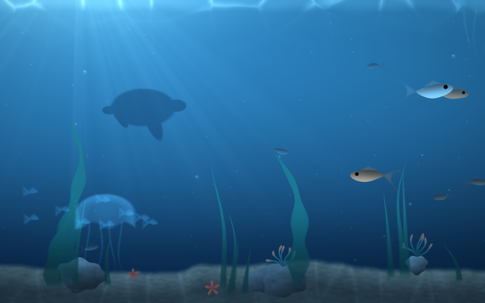

# omarchy-aquarium

An animated underwater scene as the desktop background on Hyprland/Omarchy.
The whole aquarium — water, light shafts, caustics, sand, weed, boulders,
bubbles and fish — is one fragment shader; there is no video, no image, and no
scene graph.

## How it sits on the desktop

The renderer opens one `wlr-layer-shell` surface per output on the **bottom**
layer: above the wallpaper, below every window. Omarchy's own background plugin
keeps running underneath, so the solar wallpaper rotation, `omarchy theme bg`
and the lock screen are all untouched — turning the aquarium off falls straight
back to the normal wallpaper with nothing to restore.

The surface takes an empty input region, so clicks and touches pass through it.

## Usage

    omarchy-aquarium-toggle          # on/off  (bound to SUPER + ALT + A)
    omarchy-aquarium-toggle status

Renderer flags:

    --fps N          frames per second (default 60; at the display's own rate
                     frames lock to the compositor's vblank)
    --speed X        animation speed multiplier
    --fish N         number of fish, 0-16 (default 11)
    --weed N         seaweed and kelp blades, 0-20 (default 14)
    --jelly N        jellyfish, 0-5 (default 3)
    --anemone N      anemones on the boulders, 0-4 (default 2)
    --starfish N     starfish on the sand, 0-4 (default 2)
    --turtle 0|1     a turtle passes by every few minutes (default 1)
    --theme          tint the water from the current Omarchy theme
    --output NAME    only draw on this output
    --layer L        bottom (default) or background
    --buffer-scale N render at scale N instead of the output's
    --no-react       ignore the cursor and the control pipe
    --no-suspend     keep drawing even behind a fullscreen window
    --stats          log frames per second every 5s
    --shader FILE    load a fragment shader from FILE instead of the built-in

The toggle script runs `--theme --fps 60`. To change that, put flags in
`~/.config/omarchy-aquarium/options`, one line or space separated:

    --fish 14 --jelly 5 --turtle 0 --speed 0.8 --fps 24

`--theme` reads `~/.local/state/omarchy/current/theme/colors.toml` and steers
the water hue from it, while sand, stone and fish keep fixed hues — an accent
colour is allowed to be anything, and blue sand does not read as sand. An
installed `theme-set` hook restarts the aquarium when the theme changes.

## Reactivity

The tank notices the desktop, and all of it is CPU-side — the shader gets the
same uniforms either way, so reacting costs nothing per pixel:

- **The cursor.** Fish keep a polite distance: bring the pointer near one and
  it darts away, nose pitched into the motion, then drifts back to its path.
  Close (large) fish are shyer than distant ones. The cursor is polled from
  Hyprland at 15 Hz; the layer surface itself still takes no input.
- **Notifications.** `omarchy-aquarium-notify` (started by the toggle) watches
  the session bus read-only; a desktop notification writes `startle` to the
  control pipe at `$XDG_RUNTIME_DIR/omarchy-aquarium.ctl` and the whole tank
  flinches — each fish bolts along its swimming direction and settles over a
  few seconds. Try it: `omarchy-aquarium-toggle startle`. Anything else can
  poke the same pipe.
- **Night.** After civil twilight (the same solar tracking that moves the
  sun), the jellyfish become faintly bioluminescent: a cold cyan glow that
  breathes with the bell's pulse. This is the one shader-side piece, gated to
  jelly pixels; the daytime image is bit-identical to before.

`--no-react` turns off the cursor and the pipe (the night glow rides `--day`
/ solar state, not reactivity).

## Cost

At the native 2560x1600 buffer on an M2 (Asahi, Mesa) the full scene renders in
**~16 ms/frame with the GPU saturated**, and more slowly at the low clocks the
firmware grants a light duty cycle. Do not benchmark it with back-to-back draws
into one framebuffer: Apple GPUs hidden-surface-remove every opaque draw but
the last, and that bench reports a fantasy (0.4 ms). `--bench N --pipe` in the
preview alternates render targets and reports the honest number.

What keeps the cost down:

**It stops completely when it cannot be seen.** Wayland has no occlusion signal
for layer surfaces, and Hyprland keeps sending frame callbacks to a background
layer nobody can see. So the renderer watches Hyprland's event socket and
suspends whenever the active workspace has a fullscreen window — and tears the
whole EGL surface down with it, handing ~50 MB of swapchain buffers back to the
system right when the fullscreen app is what wants the memory. The layer
surface unmaps and re-maps on resume. `--no-suspend` opts out.

**Presentation locks to the compositor.** At the display's own rate, frames are
paced by frame callbacks (no wall-clock beat against the vblank), the swap
never blocks the event loop, and the next frame is drawn while the previous
one waits for its vblank — half-idle GPUs look like light load to the DVFS
governor, which then never grants the clocks the deadline needs. Below the
display rate the idle gaps are deliberate: that is where the battery savings
live.

**It climbs out of the DVFS trap.** The GPU's clock governor makes the full
display rate bistable: miss the deadline once and the clocks sag, guaranteeing
the next miss. Three things break the loop: commits keep flowing on the wall
clock with up to two frames in flight (so the flip up to full rate does not
wait on the frame-callback chain it is trying to accelerate), a two-second
full-resolution burst warms the clocks whenever a full-rate attempt starts,
and while at full rate a ninth of a frame of throwaway work per cycle keeps
the GPU saturated enough that the governor holds the clocks. Delivered on an
M2: 53–58 fps with glass-blurred windows on screen. If the rate truly
collapses (under 75% for fifteen seconds), the renderer locks the exact half
rate — a perfectly even 30 beats an uneven 40 — and retries every two
minutes.

**Everything that moves is placed on the CPU.** Fish, bubble, jelly, school
and turtle positions are pure functions of time; `anim.c` computes them once
per frame and uploads them as uniforms, so per pixel the loops are two
compares per entity. Bubbles are seed-sorted by column and gated per quad.

**The entity seeds are data, not hashes.** Every fish, blade, boulder and jelly
used to derive its place from `fract(sin(big) * 43758…)` — and whether that
ran on the GPU or was constant-folded by the shader compiler depended on the
exact loop shape, so touching control flow silently rearranged the scene. The
seeds now live in `seeds.c` and are passed as uniforms; the embedded build
(`tools/gen_shader.py`) additionally unrolls the entity loops and inlines the
seeds as literals so per-entity positions hoist into the driver's once-per-draw
preamble. Per pixel, an open-water fragment runs a handful of compares per
entity and none of the heavy shading.

**The shader gates by region.** Caustics only exist where they survive 8-bit
quantisation, the sea-floor height field is skipped above the dunes' reach,
seaweed is tested per grove before per blade, and every entity has a cheap
bounding test before its real math.

## Building

    make            # build/omarchy-aquarium
    make install    # into ~/.local/bin
    make preview    # build/aquarium-preview, the offscreen renderer

`aquarium-preview` renders single frames without touching the desktop, which is
how the scene was tuned:

    ./build/aquarium-preview --time 33 --theme --out frame.ppm
    ./build/aquarium-preview --bench 200 --pipe --out /dev/null

Editing `src/aquarium.frag` and rerunning `make` is the whole iteration loop;
`--shader src/aquarium.frag` skips the rebuild.

Dependencies: `wayland-client`, `wayland-egl`, `egl`, `glesv2`,
`wayland-protocols` and `wayland-scanner`. The layer-shell protocol XML is
vendored in `protocol/`, so `wlr-protocols` need not be installed.
